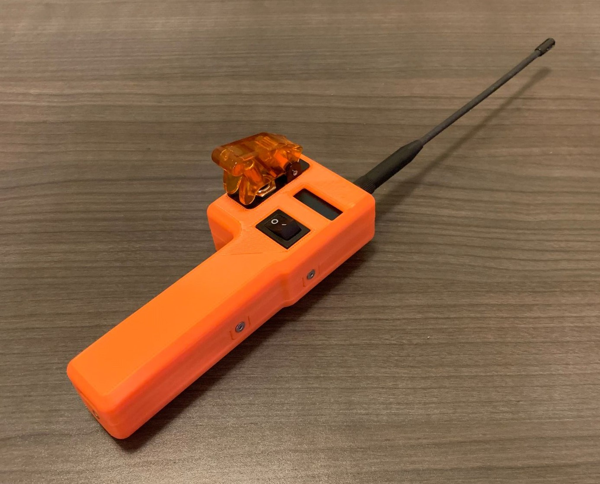
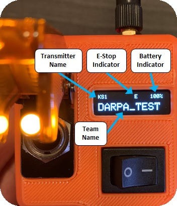

# E-Stop Transmitter Design Files

*Version 2 - FEB 2020*



## Contents:
1. [3D Printing](#1-3d-printing)
2. [XBee Configuration](#2-xbee-configuration)
3. [Assembly](#3-assembly)
4. [Programming](#4-programming)
5. [Operation](#5-operation)

## 1. 3D Printing

The case of the E-Stop transmitter is comprised of two parts: an upper receiver and a lower receiver.  Each receiver houses several components, and the two parts mate together to form the body of the transmitter.

The design files for these parts have been provided in this package:

```
./hardware/lower_receiver.stp
./hardware/upper_receiver.stp
```

These parts are intended to be 3D printed.  The original design allows for printing on a standard desktop FDM 3D printer with a single extruder.  Other printers may be used at your own discretion.

It is recommended that the parts be printed in ABS plastic, however PLA or another form of plastic may be used as well.

For printing on a single-extruder printer without dissolvable filament, both receivers must be printed with the interior (hollow) face mated to the bed of the printer.  Supports must be used.  We recommend using Simplify 3D as a slicer because it has superior support structure generation.

Curling may be an issue for ABS prints due to the low surface area mating the part to the bed.  A raft is recommended for all plastics.  For ABS, a heated build plate and enclosed print volume will be necessary.

After printing, ensure that all dissolvable or supporting material is fully removed, or certain components will not fit (especially the rechargeable battery).

## 2. XBee Configuration

Before assembling your transmitter, you must configure the transmitter's XBee module.  This can be accomplished using Digi's XCTU utility and the XBee configuration file provided in this package.

1. Download and install the XCTU utility from the [Digi website](https://www.digi.com/products/iot-platform/xctu#productsupport-utilities).
2. Connect the XBee to the computer using the USB Adapter Board from your transponder.
3. Click the **Add Radio** button in XCTU to connect to the XBee. Once connected, make sure that your working mode in XCTU is set to _Configuration Mode_.
4. Click the **Profile** button, followed by **Apply Configuration**. This will bring up a dialog to select a configuration profile to upload to your XBee.
5. Select the profile provided in this package at `./xbee_profiles/e-stop_configuration.xpro`. This will start uploading the configuration to your XBee.
6. Set your **Node Identifier (NI)** parameter to match the following format: `my_transmitter_name-my_team_name`. For example, you may use `ES1-DARPA` (where ES1 stands for E-Stop #1, and the team name is DARPA).
    * **NOTE:** Do not use a dash ('-') in any part of the transmitter OR team name. This is a reserved character.
	* **NOTE:** `my_transmitter_name` must be 3 characters or less.
	* **NOTE:** `my_team_name` must be 11 characters or less.
    * **NOTE:** Don't forget to click the **Write** button to save the parameter to your Xbee.
7. You may optionally set a common encryption key for your transmitter and transponder XBees using the **AES Encryption Key (KY)** parameter.

Your e-stop transmitter is now properly configured.

**NOTE:** You may use the same process above to configure your platform transponders.  In step 5, simply load the transponder's configuration instead, which is provided in this package at `./xbee_profiles/transponder_configuration.xpro`.

## 3. Assembly

This section provides all information needed to assemble the E-Stop Transmitter.

**Supporting Files:**

* Electrical Schematic: `./electrical_schematic.jpg`
* Assembly Photos: `./assembly_photos/*`

**Tools Needed:**

* Soldering Iron
* Solder
* Wire Cutter/Stripper
* Exacto Blade
* M2, M2.5, and M3 taps
* 2mm and 2.5mm Hex Drivers
* Hot Glue Gun or Super Glue
* Multimeter
* Crescent Wrench

**Instructions:**

_NOTE: Most steps have supporting images in the assembly_photos directory._

1. Use the metric taps to thread the upper and lower receivers.
    * Use the M2.5 tap on the case mating holes on the sides of the lower receiver.
	* Use the M2 tap for the OLED mounting holes on the lower receiver.
	* Use the M3 tap for the XBee carrier mounting holes on the upper receiver.
2. Insert the battery into the lower receiver, with the wires facing towards the top of the receiver. [(photo)](assembly_photos/step_2.jpg)
3. Attach the _E-Stop Toggle Switch_ to the upper receiver using the following steps:
	* Bend the two bottom pins of the _E-Stop Toggle Switch_ to a 90deg angle. [(photo)](assembly_photos/step_3a.jpg)
    * Adjust the vertical positioning nut on the bore of the switch so that there is just enough thread on the outside of the upper receiver to place the cover and outer nut. [(photo)](assembly_photos/step_3a.jpg)
	* Insert the switch in through the back of the upper receiver, with the side with two pins facing towards the bottom of the upper receiver. [(photo)](assembly_photos/step_3a.jpg)
	* Place the toggle cover (in the open position) on the outside of the upper receiver, and fasten tightly using the second nut. [(photo)](assembly_photos/step_3b.jpg)
4. Attach the _Power Rocker Switch_ to the upper receiver using the following steps:
    * Cut the leads off of the rocker at the bend point. [(photo)](assembly_photos/step_4a.jpg)
	* Insert the rocker switch into the receiver, with the "on" side of the switch on the right side of the receiver. [(photo)](assembly_photos/step_4b.jpg)
5. Configure the _Pro Trinket Lipoly Backpack_ with the following steps:
    * Solder the jumper closed on the back side of the board. [(photo)](assembly_photos/step_5a.jpg)
	* Cut the switch trace on the front side of the board and verify disconnection with a multimeter. [(photo)](assembly_photos/step_5b.jpg)
6. Solder 2x 140mm wires to the switch pins on the _Pro Trinket Lipoly Backpack_. [(photo)](assembly_photos/step_6.jpg)
7. Solder a 3-pin block of male header pins to the USB/G/BAT pins on the top side of the _ItsyBitsy_, and cut excess from the bottom side of the board. [(photo)](assembly_photos/step_7.jpg)
8. Solder the _Pro Trinket Lipoly Backpack_ onto the _ItsyBitsy_, following the schematic. Trim only the USB male pin, leaving the other two pins full length. [(photo)](assembly_photos/step_8.jpg)
9. Solder a 170mm wire and a 10K resistor to Pin 9 on the _ItsyBitsy_. Bend the resistor towards the the 3-pin header block. [(photo)](assembly_photos/step_9.jpg)
10. Solder the 10K resistor from Pin 9 to the G pin of the 3-pin header block, following the schematic. [(photo)](assembly_photos/step_10.jpg)
11. Solder the 15K resistor to the _Pro Trinket Lipoly Backpack_ BAT pin. Bend the resistor towards A3, and insert it through A3 but do not solder yet. [(photo)](assembly_photos/step_11.jpg)
12. Solder a 60mm wire and a 47K resistor into GND on the _ItsyBitsy_, right next to the MISO pin. Bend the resistor towards A3, insert it into A3 along with the 15K resistor from Step 11, and solder both into place. [(photo)](assembly_photos/step_12.jpg)
13. Solder 3x 150mm wires to pins 7, SDA, and SCL on the _ItsyBitsy_. [(photo)](assembly_photos/step_13.jpg)
14. Solder 2x 60mm wires to pins TX and RX on the _ItsyBitsy_. [(photo)](assembly_photos/step_14.jpg)
15. Solder a 140mm wire to the 3V pin on the _ItsyBitsy_. [(photo)](assembly_photos/step_15.jpg)
16. Solder a 150mm and 80mm wire to the VHI pin on the _ItsyBitsy_. [(photo)](assembly_photos/step_16.jpg)
17. Solder a 100mm and 140mm wire to the GND pin next to Pin 8 on the _ItsyBitsy_. [(photo)](assembly_photos/step_17.jpg)
18. Place the _ItsyBitsy_ into the upper receiver, and glue into place at each corner using hot glue or super glue. Be sure not to block the mating channels for the lower receiver. [(photo)](assembly_photos/step_18.jpg)
19. Attach the _OLED Display_ using the following steps:
    * Temporarily place the _OLED Display_ into its position on the upper receiver, with the pin holes towards the top of the receiver.
	* Following the schematic, route the _OLED Display_ wires from the _ItsyBitsy_ up through the receiver to the proper pin positions on the _OLED Display_.
	* Carefully trim any excess wire from the _OLED Display_ wire leads. See [photo](assembly_photos/step_21.jpg) from Step 21 for proper wire routing.
	* Solder the SDA, SCL, Pin 7, VHI, and GND wire leads from the _ItsyBitsy_ to the appropriate pins on the _OLED Display_, following the schematic. [(photo)](assembly_photos/step_19.jpg)
	* Attach the _OLED Display_ to the upper receiver using 4x M2x4mm screws. See [photo](assembly_photos/step_21.jpg) from Step 21 for proper positioning.
20. Solder the _E-Stop Toggle Switch_ wires using the following steps:
    * Route the _E-Stop Toggle Switch_ wires through the upper receiver, aligning the wire leads according to the schematic.  Carefully trim wire leads to appropriate length.  See [photo](assembly_photos/step_21.jpg) from Step 21 for proper wire routing.
	* Solder the 3V, Pin 9, and GND wire leads to the _E-Stop Toggle Switch_ according to the schematic. [(photo)](assembly_photos/step_20.jpg)
21. Solder the _Power Rocker Switch_ wires using the following steps:
	* Route the _Power Rocker Switch_ wires through the upper receiver, aligning the wire leads according to the schematic. Carefully trim wire leads to the appropriate length.  See [(photo)](assembly_photos/step_21.jpg) for proper wire routing.
	* Solder the _Pro Trinket Lipoly Backpack_ switch wire leads to the _Power Rocker Switch_ according to the schematic. [(photo)](assembly_photos/step_21.jpg)
22. Trim the remaining wires from the _ItsyBitsy_ to length, so that they all evenly reach the middle case holes on the sides of the upper receiver. Crimp female contacts onto the wires, and attach a 4-pin rectangular housing according to the schematic. [(photo)](assembly_photos/step_22.jpg)
23. Solder 4x 140mm wires to the GND, 5V, DIN, and DOUT pins on the _XBee Carrier_. [(photo)](assembly_photos/step_23.jpg)
24. Attach the _XBee Carrier_ to the lower receiver using 4x M3x5mm screws. [(photo)](assembly_photos/step_24.jpg)
25. Insert the _XBee Module_ into the _XBee Carrier_, and bend the four wires up over the top of the XBee (positioning two wires on each corner). [(photo)](assembly_photos/step_25.jpg)
26. Trim the _XBee Carrier_ wires to length, so that they all evenly reach the middle case holes on the sides of the lower receiver. Crimp male contacts onto the wires, and attach a 4-pin rectangular housing according to the schematic. [(photo)](assembly_photos/step_26.jpg)
27. Connect the rectangular housings from the upper and lower receivers, being mindful of the polarity and following the schematic.
28. Connect the battery leads to the _Pro Trinket Lipoly Backpack_, being mindful of the polarity.
29. Attach the upper receiver casing to the lower receiver casing using 6x M2.5x5mm flathead screws. When attaching, ensure that all wires are positioned safely inside of the receivers, and not straddling the mating edges of the receivers. Depending on the quality of the print, you may need to forcefully press the two receivers together to align the holes for the flathead screws. Be careful not to strip the threads in the receiver plastic. [(photo)](assembly_photos/e-stop_transmitter.jpg)

## 4. Programming

This package includes all necessary Arduino code for the E-Stop transmitter under the `./arduino_code/` directory.

**Installation**

1. Copy all directories from this package's `./arduino_code/libraries/` directory into your local `Arduino/libraries/` directory.
2. Copy this package's `./arduino_code/estop_transmitter` directory to your local `Arduino/` directory.

**Uploading**

1. Attach a USB cable to your computer and through the _ItsyBitsy_ USB port that is exposed at the bottom of the transmitter handle.
2. Open the Arduino IDE and configure it for programming the _ItsyBitsy 32u4 3V_ microcontroller.  Follow the [instructions](https://learn.adafruit.com/introducting-itsy-bitsy-32u4/arduino-ide-setup) provided by Adafruit for proper configuration. **NOTE:** Ensure that you configure the IDE for the **3V** version of the _ItsyBitsy_ and **NOT** the 5V version.
3. Open the `estop_transmitter` sketch in the Arduino IDE and upload it to the _ItsyBitsy_.

## 5. Operation

**Charging:**

The USB Micro B port located at the bottom of the transmitter handle is used to charge the internal battery.  Connect this to a 5V, 2A USB power supply (phone chargers are fine).  You will see a red light turn on inside of the transmitter, which will be visible through the 3D printed plastic if you used orange ABS or PLA.  This light indicates that it is charging.  The charger circuit will automatically turn off when the battery is fully charged.

**Usage:**

Use the _Power Rocker Switch_ to turn on the transmitter.  A "Loading..." screen will display while the transmitter powers up.  **NOTE:** Always ensure that the _E-Stop Toggle Switch_ is in the **OFF** position before turning on the transmitter.

Once the transmitter is fully powered on and ready to operate, the display will show the following:



When you want to trigger an emergency stop, simply open the toggle switch guard and flip the switch to the ON position.  You will see the light on the toggle switch turn on.  This will immediately start broadcasting emergency stop messages, and will continue to do so until you switch the toggle switch back into the OFF position.  The display will show an "E" at the top center whenever it is broadcasting emergency stop messages.
